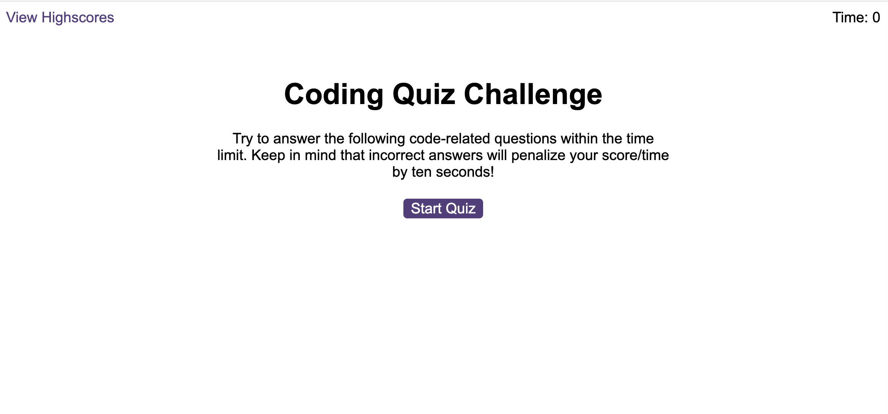
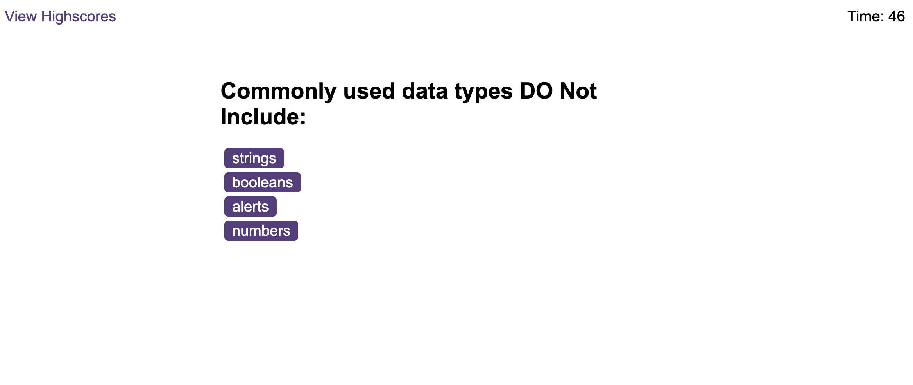
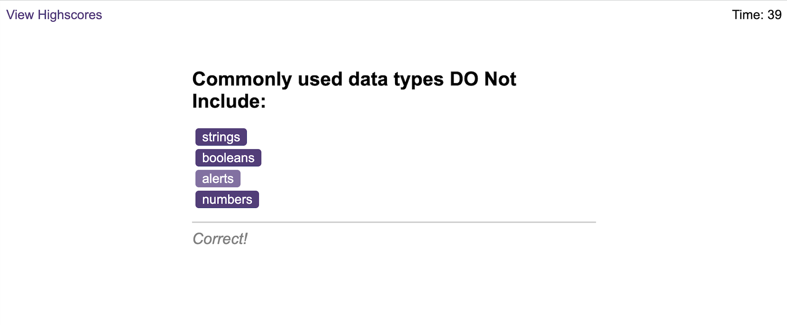
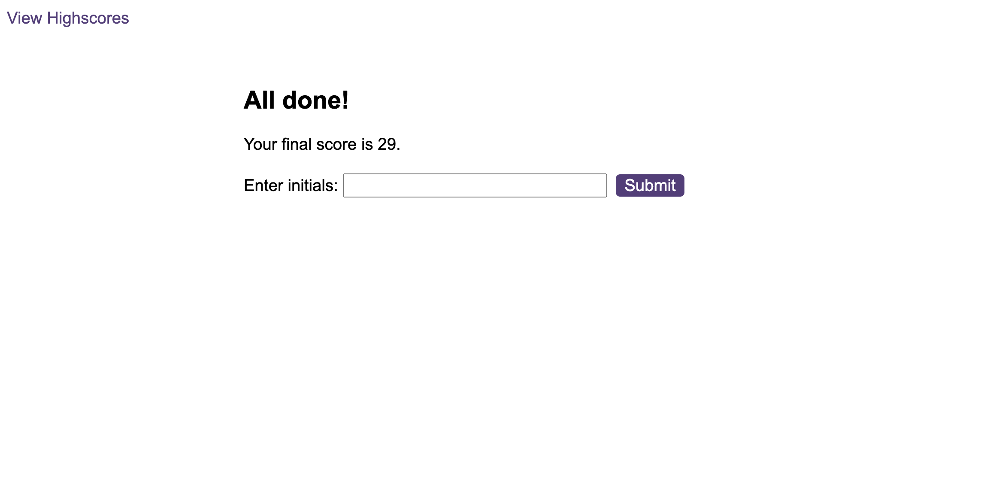
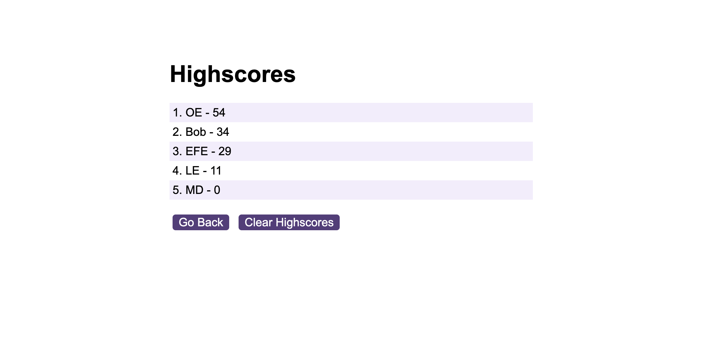

# Coding Quiz App
I created a timed, multiple-choice coding quiz that can keep track of high scores and quiz-takers initials.

## Live Link
https://ozgunefe.github.io/coding-quiz-app/

# App Screenshots

## Start Screeen

## Question Screen

## Feedback Alert

## User Input Screen

## High Score List Screen
